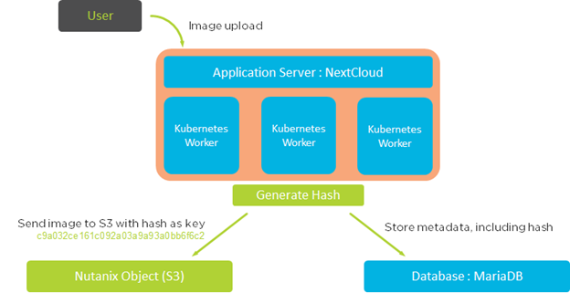
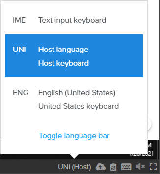
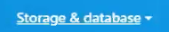

.. _KarbonObjectBootcamp:

.. role::   raw-html(raw)
      :format: html

Advanced Bootcamp (Automation)
==============================

Topics
------
-  Nutanix Karbon

-  Nutanix Object

-  Nutanix Era

Goal
----

Setup a fully working NextCloud solution, highly available, hosted on a
Kubernetes cluster.

The MariaDB database backend will be deployed and protected using
Nutanix Era solution.

An object storage solution, deployed with Nutanix Object will be used as
an external repository, setup on the NextCloud platform.

Design
------

Global architecture

|image0|

Kubernetes Storage Access

|image1|

Deployment
----------

Connect to your Frame Desktop, using the Frame Jumphost URL, your Frame
User and the Frame Jumphost Password as provided in Ressources lab
document. You’ll stay on this Jumphost for all the lab.

Please change the keyboard layout to UNI, this will use your keyboard
layout.

|image2|

In the Lab guide we use the word “burger” It’s the menu start on the top
left of Prism Central, which look like this |image3|

Please use the **Google Chrome** browser in the Frame Jumphost for the
entire lab.

As the keyboard mapping, or copy / paste something has some strange
behavior, some scripts / text are available on an AWS Bucket. It will be
indicated how to get it on the documentation when needed.

Objects
-------

**This is a showcase, do not click on create, and click cancel afterwards, as an object store has 
already been created for you.**

-  With Google Chrome, **connect** to the **Prism Central** (as provided
   in Ressources lab document), click on the\ |image4| Burger Menu,click 
   **Services**, click **Objects**
-  Click **Create Object Store** / Continue
-  Enter an object store name based as provided in Ressources lab
   document / next
-  Select performance (Estimated) to Custom. It will deploy a very small
   object instance to save cluster resources for other LAB
   participants.(don’t change vCPU or Memory)
-  Set 100 GiB as capacity / Next
-  Select **your corresponding** Nutanix Cluster
-  Select Managed-Network for both Object Infra Network and Objects
   Public Network. Enter the Objects Infra IPs and Object Public IPs
   with the information provided in Ressources lab document. 

.. hint::

    The creation of an object store is time-consuming and not feasible 
    in this time with parallel staging

Karbon/Kubernetes Cluster
-------------------------

-  Go to **Prism Central**, click on the |image5|\ Burger Menu, click
   Services, click Karbon
-  Click **create a Kubernetes Cluster**
-  Select **Production Cluster** / Next 

-  **Name and Environment**
  
   -  Enter a name, as provided in Ressources lab document, and select
      **your corresponding** Nutanix Cluster / Next 
      **(leave k8s and Host OS out for now)**

-  **Node Configuration**

   -  Select the network named Managed-Network

   -  Enter a master VIP Address (as provided in Ressources lab
      document) / Next

   -  Keep the Flannel Network Provider

   -  Note:(Calico is supported as well, but requires additional
      steps).

   -  Keep the CIDR range by default / Next

-  **Network**

   -  /Next

-  **Storage-Class**

   -  Select once again **your corresponding** Nutanix Cluster

   -  Enter the cluster username (admin) and password (Nutanix Password
      in the ressources lab document) / Create. Click only once on
      the create button, and wait the popup to be closed, otherwise,
      you’ll deploy multiple time the cluster and the deployment will
      fail!!!

.. hint::

    Wait for the deployment completion. It will take around 15 minutes to 
    complete, go to the next section in the meanwhile

Era
---

-  Open a new tab, and access the Era IP Address Server as provided in
   Ressources lab document

-  Click to Dashboard on the top left section / Databases

-  Click Source / Provision / MariaDB

-  Enter the following information

   -  Create New Server

   -  Database Server Name : mariadb-*yourinitial*-01

   -  Software Profile : Select the only one available

   -  Compute Profile : DEFAULT_OOB_COMPUTE

   -  Network Profile : MariaNW

   -  SSH KEY : Select Text, and copy paste the following string (it’s a
      one line text!)

.. code-block:: Bash
    
    ssh-rsa AAAAB3NzaC1yc2EAAAABJQAAAQEAiC8r6cLFLn/c/iR8TKXQhN20wUQwua8DSZM7rpGwuxbgLSSznW/hEVIogx3UoRamU3lIDsD8QKLBiHg29xc/PvR/Ro5Fxvhih3XOQTC14cEwPvgXgMHgPBJ5Vw+bW3a8HVM3S4dsaCsYAkDeHJmXP4G7HN4vrqc3fjb1UYV3iUe8AcheKzD7sG8MSjFBPc7WVI0I47Ly/eKVxVp0csE0fUH6IogUMqA1zp/C/uziAG1vZO6Td2S/FW70OKnCnnNRN8+e7BNlrIuy/0fLsKjUeNEgr8iuFFDoPA23vaPzcZR3hbsICOw7yoFbAsL+z+Mc6O74Nj7bT6WX3rVgMCFFYQ==

https://karbon-bootcamp.s3.eu-west-3.amazonaws.com/ssh-public-key.txt

https://karbon-bootcamp.s3.eu-west-3.amazonaws.com/ssh-public-key.txt

-  Click next, enter the following information

   -  MariadDB Instance Name : nextcloud-*yourinitial*

   -  Database Parameter Profile : DEFAULT_MARIADB_PARAMS

   -  ROOT password : nx2Tech123!

   -  Name of Initial Database : nextcloud

-  Click next, enter the following information

   -  Name : *yourinitial*\ \_nextcloud_TM

   -  SLA : DEFAULT_OOB_GOLD_SLA

-  Click Provision

-  Do not close the browser TAB

.. hint::

   It will take around 10 minutes to deploy the MariaDB Database Please
   proceed to the next section

Kubernetes Setup
----------------

-  Go to Prism Central, click on the Burger \ |image4|, Services, 
   Karbon

-  Cluster Clusters / Check your cluster name / Actions / Download
   Kubeconfig. Click on the Download link

-  Save it to ~/Downloads folder leave file name unchanged)

-  Open the file with Notepad, and copy the content of this file

-  Connect to the linux jumphost (with putty as username: yourusername
   (example userxx) pw: nutanix/4u)

To avoid to write every time the **kubectl**, will create an alias

.. code-block:: Bash
    
    alias k=kubectl

Create a folder to host the kubectl config file

.. code-block:: Bash
    
    mkdir ~/.kube

Use **vi** to configure the kubectl config file on the
linux jumphost

.. code-block:: Bash
        
    vi ~/.kube/config

Open the Downloaded kubeconfig file
(~/Downloads/karbon-<TLA>-01-kubectl.cfg in notepad
copy and paste the text) in the following file

.. hint::

Test the kubetcl configuration, an output should be shown

.. code-block:: Bash
    
    k get pods -A
    
Create a folder named metallb

.. code-block:: Bash
    
    mkdir metallb; cd metallb

Install the metallb service with the following commands

.. code-block:: Bash
    
    kubectl apply -f https://raw.githubusercontent.com/metallb/metallb/v0.9.5/manifests/namespace.yaml
    kubectl apply -f https://karbon-bootcamp.s3.eu-west-3.amazonaws.com/metallb.yaml
    kubectl create secret generic -n metallb-system memberlist --from-literal=secretkey="$(openssl rand -base64 128)"

Create a file named metallb-config.yaml with the following content,
be careful to adapt the last line with the information as provided
in ressources lab document, for the field **Karbon MetalLB Pool**

.. code-block:: Bash
        
    apiVersion: v1
    kind: ConfigMap
    metadata:
      namespace: metallb-system
      name: config
    data:
      config: |
        address-pools:
        - name: default
          protocol: layer2
          addresses:
          - x.x.x.x-y.y.y.y
  
https://karbon-bootcamp.s3.eu-west-3.amazonaws.com/metallb-config.txt

-  Configure the metallb setup
  
.. code-block:: Bash
    
    
    k apply -f metallb-config.yaml

Test the current setup, by deploying a basic nginx container

.. code-block:: Bash
    
    k create deployment nginx --image=registry.gitlab.com/fabrice.krebs/nutanix-ch/nginx

Check if the deployed worked

.. code-block:: Bash
    
    k get pods

Expose the deployment behind the metallb load balancer

.. code-block:: Bash
    
    k expose deployment nginx --name nginx --type LoadBalancer --port 80

Get and copy the external IP of the nginx service

.. code-block:: Bash
   
    k get svc

Open a second browser tab and past the IP address. The nginx webpage
should appear. If the test is successful, continue. Otherwise,

.. hint::

If your EXTERNAL-IP is listed as Pending, this indicates an issue with your MetalLB ConfigMap file.
Run kubectl describe configmap config -n metallb-system to verify your IP addresses are correct
Fix your metallb-config.yaml file and run kubectl apply -f metallb-config.yaml again

MariaDB:
--------

Now the MariaDB database server should be deployed. We will need to
retrieve the IP Address from the Era interface. Go back to the Era
Browser Tab:

-  Click on Era text on the Top Left corner

-  Click Dashboard on the Top Left corner / Database / Sources

-  Click on your database server name

-  Under section Database Server VM on the middle of the page, copy the
   IP Address or write it somewhere. We will need it later

NextCloud deployment
--------------------

-  Create a new nextcloud deployment

.. code-block:: Bash
    
    
    k create deployment nextcloud --image=registry.gitlab.com/fabrice.krebs/nutanix-ch/nextcloud

Expose the new deployment to the public network

.. code-block:: Bash
    
    
    k expose deployment nextcloud --type=LoadBalancer --name=nextcloud --port=80 --target-port=80

Retrieve the External-IP address of the deployment

.. code-block:: Bash
    
    
    k get services

Open a new tab and type the external-ip address. You should have the
nextcloud home page available.

-  Do the setup with the following information :

   -  Username : admin

   -  Password : nx2Tech123!

-  **Do not click on Finish yet**

.. hint::

   If you pushed too fast k delete deployment nextcloud ;-)

-  Click on Storage & database / MySQL MariaDB |image6|

   -  Database user : root

   -  Database password : nx2Tech123!

   -  Database name : nextcloud

   -  Replace localhost with the Database IP Address retrieved
      previously

   -  **Unckeck install recommended apps,** as it will take some time
      for applications to be deployed

Click Finish. The initial setup will proceed in a couple of minutes.
You’ll then be able to access the freshly deployed nextcloud.

-  **Do not close the browser TAB**

As the application is still initializing as a background task, the
interface will be a bit slow for a couple of minutes. We will now go to
the next section to create an Object Store bucket, and use it from the
NextCloud application.

Nutanix Object creation
-----------------------

Return to the prism central interface

-  Click on the Burger / Service / Object

-  Generate an access key by clicking on Access Keys on the top / Add
   People / Add people not in a directory service

   -  Email address : your-initial@demo.com

   -  Name : Your name

-  Click Next / Generate Keys / Download Keys (very important as you can
   get it only once)

-  Click on Object Stores on the Top / Click on your cluster

-  Write down somewhere one Object Public IP assigned from the Existing
   Object Store, we will need it for the nextcloud configuration.

-  Click on Create Bucket

   -  Name : nextcloud-yourinitials

   -  Check Enable versioning

   -  Click create

-  Click on the newly created bucket

-  Go to User Access on the left / Edit User Access

-  Search for people your-initial@demo.com

-  Check permission Read and Write / Save

Add Object Storage to NextCloud 
-------------------------------

Go back to NextCloud Tab:

-  Click on the A on the top right section / Apps

-  Go at the bottom of the windows to find External storage support,
   click on Enable

-  Click on the A on the top right section / Settings

-  On the left side, click on External Storages under the
   **Administration Section** (and not the first Personal section)

   -  Folder Name : external_storage

   -  External Storage : Amazon S3

   -  Authentication : Access Key

   -  Bucket : nextcloud-yourinitals

   -  Hostname : The Object Public IPs you’ve copied previously

   -  Keep Enable SSL unchecked

   -  Keep Enable path Style unchecked

   -  Check Legacy (v2) authentication

   -  Select admin user

   -  Access Key : The access key located on the file you’ve downloaded
      when configuring object

   -  Secret Key : The secret key located on the file you’ve downloaded
      when configuring object

   -  Click on the |image7| icone to verify and validate

-  Now the Object storage is connected, let’s try to upload some files.
   Click on the folder icone on the top left section

-  Click on external storage folder

-  Click on the |image8|\ icone on the top section, and upload a couple
   of files from the local computer. Wait for the upload to be done.
   You should see the uploaded file, which aren’t located on the
   Nextcloud itself, but store on the external object store

Check the Embedded Nutanix Object Browser
~~~~~~~~~~~~~~~~~~~~~~~~~~~~~~~~~~~~~~~~~

-  With a Web Browser, connect to the Object Public IP Address of the
   Object Store, used when creating your bucket
   (http://x.x.x.x/objectsbrowser/)

-  Enter the Access Key and the Secret Key you’d previously downloaded

-  Check if your uploaded files appear in the bucket to verify your
   configuration/setup

Additional Lab
--------------

If you have time, a couple of additional steps can be done to have a
good overview of the Nutanix solution.

Check Karbon scale-out
~~~~~~~~~~~~~~~~~~~~~~

-  On Prism Central / Burger / Service / Karbon

-  Click on your cluster / Nodes on the left side / + Add Worker and add
   1 additional node (please don’t do more than one to keep resources
   for everyone) / Create. The system will deploy and add additional
   worker nodes. You can go back in a couple of minutes to see the
   additional worker added (around 5 minutes).

Check Karbon ElasticSearch / Kibana logging stack
~~~~~~~~~~~~~~~~~~~~~~~~~~~~~~~~~~~~~~~~~~~~~~~~~

-  On Prism Central / Burger / Service / Karbon

-  Click on your cluster / Add-on / Logging

-  Go to Discover in Kibana. Under Create Index Pattern, type \* and
   click Next Step / Select @timestamp time Filter / Create Index
   Pattern

-  Go again to Discover, and select the index \* on the top. You’ll see
   all logs of the K8S deployment.

Check object metrics 
~~~~~~~~~~~~~~~~~~~~

-  On Prism Central / Burger / Service / Object

-  Click on your cluster / performance on the left side. You’ll see the
   full performance overview (change to Last 1 hour to have a better
   view)

-  Click Buckets on the left side / nextcloud / performance. You’ll see
   the performance of the specific bucket

Clone the MariaDB Database
~~~~~~~~~~~~~~~~~~~~~~~~~~

-  On Era Dashboard click on the top menu / Times Machines

-  Click on your time machine / Action

-  Click Create Clone of MariaDB Instance from Time Machine

-  Select a specific Point in Time. It will deploy a clone with the
   content of the database at a specific time / next

-  Create a New Server

   -  Database Server VM Name : mariadb-*yourinitial*-0\ **2**

   -  Compute Profile : DEFAULT_OOB_COMPUTE

   -  Network Profile : MariaNW

   -  SSH KEY : Select Text, and copy paste the following string (it’s a
      one line text!)

.. code-block:: Bash
    
    ssh-rsa AAAAB3NzaC1yc2EAAAABJQAAAQEAiC8r6cLFLn/c/iR8TKXQhN20wUQwua8DSZM7rpGwuxbgLSSznW/hEVIogx3UoRamU3lIDsD8QKLBiHg29xc/PvR/Ro5Fxvhih3XOQTC14cEwPvgXgMHgPBJ5Vw+bW3a8HVM3S4dsaCsYAkDeHJmXP4G7HN4vrqc3fjb1UYV3iUe8AcheKzD7sG8MSjFBPc7WVI0I47Ly/eKVxVp0csE0fUH6IogUMqA1zp/C/uziAG1vZO6Td2S/FW70OKnCnnNRN8+e7BNlrIuy/0fLsKjUeNEgr8iuFFDoPA23vaPzcZR3hbsICOw7yoFbAsL+z+Mc6O74Nj7bT6WX3rVgMCFFYQ== 

-  Click next, enter the following information

   -  Name : nextcloud_02

   -  Database Parameter Profile : DEFAULT_MARIADB_PARAMS

   -  New ROOT password : nx2Tech123!

-  Check schedule data Refresh. When selecting this option, the system
   will periodically retrieve the data from the source database, and
   publish it to the clone you are deploying. Very useful for DEV and
   Test platform.

Manage your Kubernetes Cluster with LENS IDE
--------------------------------------------

On your jumphost, download and install the LENS Kubernetes IDE located
at this address: https://k8slens.dev/ Choose the current
Lens-Setup-x.x.x.exe

To graphically manage the K8S cluster, the LENS IDE can be used.

-  Open the LENS IDEN

-  Click File / Add Cluster

-  Select the previously downloaded kube configuration file and keep the
   default value / Add cluster(s)

-  You’ll now see all K8S ressources graphically.

Backing Up Cloud Native Apps
----------------------------

Even though many container workloads are stateless, backup matters in Kubernetes! Think about it, with a single ``kubectl`` command you could wipe out an entire namespace containing multiple applications. Restoring workloads to a specific point in time needs to be equally as easy. In addition, backup can also be a critical component of regulatory compliance.

In this exercise we will deploy **Kasten K10**, a **Veeam** solution that integrates with **Nutanix Objects** to provide Kubernetes backup capabilities.

Configuring Objects Storage
...........................

In order to provide a storage target for our backup solution, we will add another **Bucket** within our pre-staged **Nutanix Objects Object Store**.
#. In **Prism Central**, select :fa:`bars` **> Services > Objects**.

#. Under **Object Stores**, open your existing Object Store in a new tab.

   .. figure:: media/80.png

-  Click on Create Bucket

   -  Name : k10backup-yourinitials

   -  Check Enable versioning

   -  Click create

-  Click on the newly created bucket

-  Go to User Access on the left / Edit User Access

-  Search for people your-initial@demo.com

-  Check permission Read and Write / Save

Installing K10
..............

Up to this point, we have used manually created manifest files to deploy our applications. For **K10** we will look at a more user friendly way to deploy apps using **Helm**. `Helm <https://helm.sh/>`_ is a community built and maintained package management tool for Kubernetes, similar to **yum** in CentOS or **npm** in Node.

#. On your Jumphost, run the following:

   .. code-block:: bash

      kubectl create namespace kasten-io
      helm repo add kasten https://charts.kasten.io/
      helm repo update
      helm install k10 kasten/k10 --namespace=kasten-io

   This will define a namespace on the **Kubernetes** cluster in which to manage and monitor the app, add the repository to **Helm** in order to download **K10**, and then install the application.

#. Monitor the deployment in **Lens > Workloads > Pods**.

   Select the **kasten-io** namespace and wait until all Pods are in a **Running** state, this should take < 5 minutes.

   .. note::

      You may need to close/re-open **Lens** in order to see the new **kasten-io** namespace.

   if you don´t installed **Lens** you could also use:
   .. code-block:: bash

      kubectl get pods -n kasten-io

   Similar to our other deployments, we will expose the Port to enable external access to the **K10** frontend. 

   .. code-block:: Bash
    
      k expose deployment nextcloud --type=LoadBalancer --name=nextcloud --port=80 --target-port=80

   Retrieve the External-IP address of the deployment

   .. code-block:: Bash 
    
      k get services

   Open a new tab and type the external-ip address.

   If your deployment was successful, you will be prompted with the EULA.

Configuring K10
...............

Now that we have prepared our storage target and deployed **K10**, we're ready to configure **K10** to use our Objects storage and create our first backup policy.

#. In your browser, **Accept** the **K10** EULA.

   .. note::

      If prompted to **Take a Quick Tour**, click **No**.

   You should now see the **K10** dashboard, including multiple applications that have already been discovered on your cluster.

#. Click **Settings**.

   .. figure:: media/93b.png

#. Under **Location Profiles**, click **+ New Profile**.

#. Fill out the following fields:

   - **Profile Name** - nutanix-objects
   - **Cloud Storage Provider** - S3 Compatible
   - **S3 Access Key** - *From your user##-k10@lab.local-keys-<DATE>.txt file downloaded from Objects*
   - **S3 Secret** - *From your user##-k10@lab.local-keys-<DATE>.txt file downloaded from Objects*
   - **Endpoint** - https://ntnx-objects.ntnxlab.local
   - Select **Skip certificate chain and hostname verification**
   - **Region** - *Leave blank*
   - **Bucket Name** - user\ *##*\ -k10-bucket

   .. figure:: media/95.png

   .. note::

      Don't worry Sebastien, these keys aren't valid.

#. Click **Save Profile**.

   You should see a green dialog indicating the connection was successful. Otherwise, ensure your profile inputs are accurate and try saving again.

   Next we'll configure a backup policy.

#. Click **< Dashboard** to return to the **K10** dashboard.

   .. figure:: media/96.png

#. Under **Applications**, select **Unmanaged**.

#. Under **default**, click **Create Policy**.

   .. figure:: media/97.png

   Each of the boxes map to a specific Namespace in your Kubernetes cluster.

#. In the **New Policy** window, leave all of the default snapshot frequency settings.

#. Select **Enable Backups via Snapshot Exports** and ensure **Export Location Profile** is set to your **nutanix-objects** profile.

   .. figure:: media/98.png

   This will export the snapshots created by K10 to your S3 bucket.

#. Click **Create Policy**.

   Instead of waiting for the next scheduled snapshot to take place, we'll force the first backup.

#. Click **Run Once** and **Run Policy**.

   .. figure:: media/99.png

#. Click **< Dashboard**.

#. Under **Activity**, you should see your backup job complete after a few seconds. Select it and view the resources that were exported as part of the backup.

   .. figure:: media/100.png

Restoring K10 Backups
.....................

Now that we have a successful backup, we can restore "clones" of your applications to a separate namespace on the cluster.

#. Select **Applications** from the **K10** dashboard.

#. Under the **default** namespace, click **Restore**.

   .. figure:: media/101.png

#. Select your **default-backup** restore point and then click the **EXPORTED** version.

   .. figure:: media/102.png

   This will ensure we're restoring the data from the Nutanix Objects bucket, and not a local snapshot.

#. Under **Restore Point > Application Name**, click **+ Create A New Namespace**:

   - **New Namespace** - default-restore

   .. figure:: media/103.png

   This will update the **Application Name** to your new namespace.

#. Under **Restore Point > Artifacts**, click **Deselect All Artifacts**.

#. Select only your **fiesta-web-pods** Deployment and your **fiesta-web-svc** Service.

   .. figure:: media/104.png

#. Click the **Restore > Restore** button to start the restore process.

   .. note::

      You may see a *Slow Connection* message pop up. This can be safely ignored.

#. Click **< Dashboard** to return to the dashboard.

   Under **Activity**, you should see your restore operation either **Running** or **Completed**.

   .. figure:: media/105.png

#. In **Lens > Workloads > Pods**, filter for your **default-restore** namespace and observe your Fiesta pods running.

   .. figure:: media/106.png

   *Based on what you've learned so far in the lab, can you build a Traefik route to connect to your default-restore version of your app?*

#. Return to **Prism Central >** :fa:`bars` **> Services > Objects > ntnx-objects** and click your bucket.

   Here you can view the number of objects stored within the bucket and the storage being consumed.

#. Select **Performance** from the left-hand menu to view the load your backup policy has applied to the bucket.

   .. figure:: media/107.png

#. You can also view the bucket contents using the built-in Objects Browser by opening \http://*<OBJECT-STORE-PUBLIC-IP>*:7200 in your browser and logging in with the keys assigned to your **user**\ *##*\ **-k10** user.

   .. figure:: media/108.png

   .. note::

      The snapshot exports from **K10** aren't human readable, so don't expect to find your original **YAML** files!

.. raw:: html

    <H1><a href="http://lookup.ntnxworkshops.com/" target="_blank">
Click Here To Submit Validation Request
</a></H1>

After completing these exercises you should now be more familiar with the infrastructure considerations for production Kubernetes environments.

Nutanix Karbon provides significant value in the deployment and management of your Kubernetes infrastructure, while still providing an open platform capable of integrating with other stack components for logging, monitoring, backup, and more.

For Instructors
===============

Link to Lab
-----------

https://docs.google.com/document/d/1Olu6xKqkbwPKplyKfI6ijDtlHb9XIZIIr15kXNCBLLU/edit#heading=h.yptqwv4kn3ni

.. |image1| image:: media/image1.png
   :width: 3.08333in
   :height: 3.88542in

